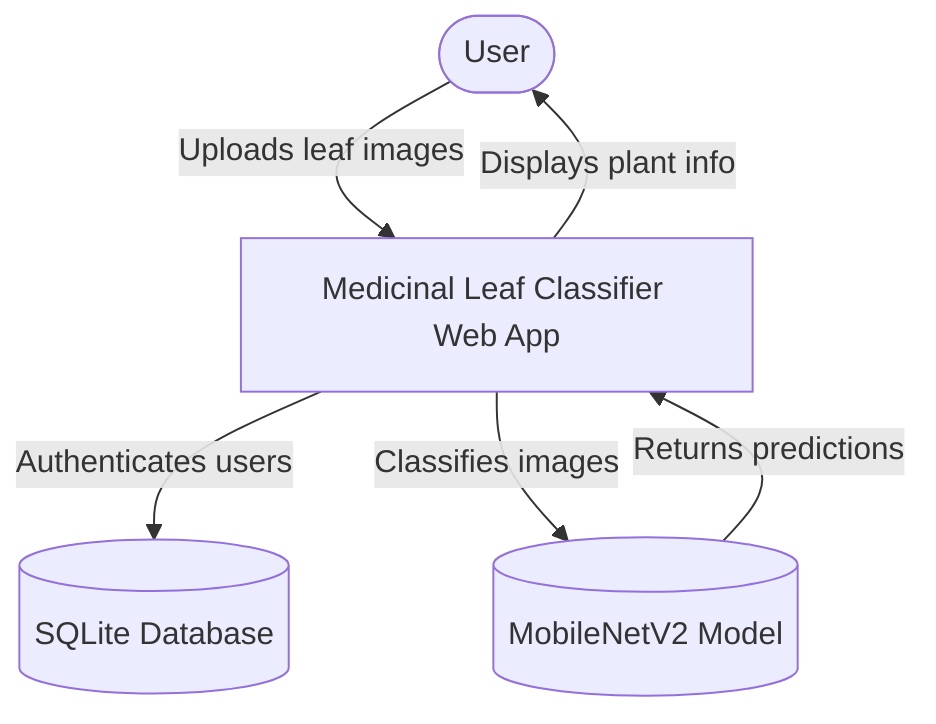
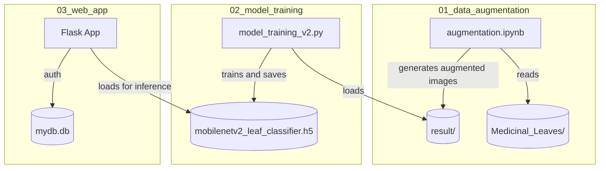

# System Architecture

This document describes the high-level system architecture of the Medicinal Leaf Classifier following the massive codebase refactoring in April 2026.

## Context Architecture

The system enables users to upload photos of medicinal leaves through a web interface, which are then processed by a dual-model machine learning pipeline (MobileNetV2 classification and HSV segmentation) to provide botanical identification and medical treatments.



## Container Architecture

The project is structured into three primary logical zones, representing the machine learning lifecycle: Data Augmentation, Model Training, and Web Application deployment.



## Component Architecture: Web App (`03_web_app/`)

The monolithic `web_app.py` was decomposed into modular components, isolating configuration, database logic, inference logic, and routing.

```mermaid
flowchart TB
    Client[Web Browser]
    
    subgraph Flask App
        app(app.py - Routing & Controllers)
        config(config.py - Globals & Paths)
        db_mod(database.py - SQLite logic)
        pred_mod(prediction.py - ML logic)
    end
    
    Client <-->|HTTP GET/POST| app
    app -->|Imports keys| config
    app -->|Validates/Creates user| db_mod
    app -->|predict_leaf(image)| pred_mod
    
    pred_mod -->|loads bounds| config
    pred_mod -->|loads paths| config
```

### Module Responsibilities
*   **`config.py`**: Centralizes all configuration, constants, and Paths (e.g., `LABEL_NAMES`, `HSV_LOWER_BOUND`, `MODEL_DIR`).
*   **`database.py`**: Handles SQLite logic, user creation, and basic authentication queries.
*   **`prediction.py`**: Prepares the image `preprocess_image()`, runs HSV segmentation `segment_leaf()`, and computes confidence scores.
*   **`app.py`**: Sets up Flask routes, template rendering, and file upload form handling.
