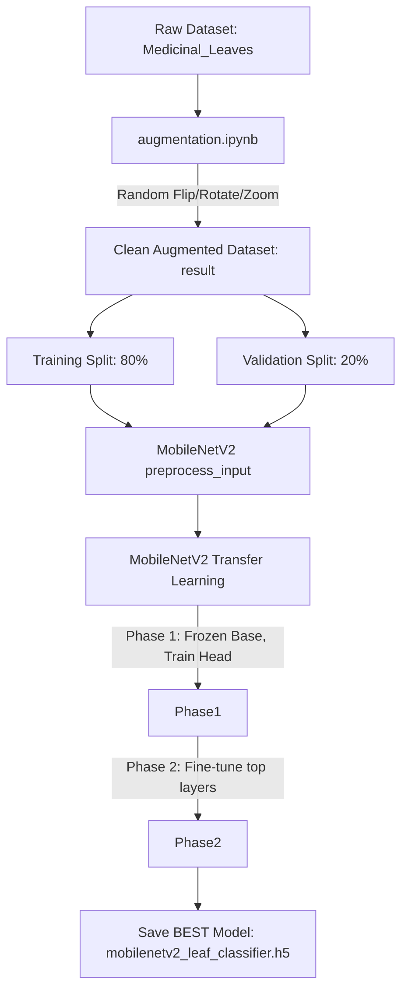

# Machine Learning Pipeline

This document details the machine learning lifecycle for the Medicinal Leaf Classifier, highlighting the fixes made to resolve critical bugs (double normalization, data leakage, and contamination) in April 2026.

## Pipeline Overview

## Data Augmentation Phase (`01_data_augmentation/`)

The original dataset of ~13 classes was deeply imbalanced. To fix this, we run `augmentation.ipynb`.
*   **Objective**: Reach precisely 500 images per class.
*   **Transformations**: Max 30° rotation, horizontal flip, multi-axis zoom and shear using `ImageDataGenerator`.
*   **Storage**: Originals + Augmented are saved securely into a clean `result/` directory, preventing source data contamination.

## Model Training Phase (`02_model_training/`)

The model uses a **MobileNetV2** architecture due to its edge-friendly efficiency and state-of-the-art accuracy on feature extraction.

### Architecture
1.  **Base**: `MobileNetV2` trained on ImageNet (Excluding the top fully-connected layers).
2.  **Runtime Augmentation**: Sequential layers (`RandomFlip`, `RandomRotation`, `RandomZoom`) to prevent overfitting.
3.  **Head**: 
    - `GlobalAveragePooling2D()`
    - `Dropout(0.3)` (Crucial for regularization)
    - `Dense(13, activation='softmax')`

### Training Strategy (Two-Phase Fine-Tuning)
The custom script `model_training_v2.py` employs industry-standard transfer learning:

1.  **Phase 1 (Frozen Base)**: 
    *   The MobileNetV2 base is strictly frozen (`trainable = False`).
    *   Trains only the new top `Dense` head.
    *   Allows the randomly-initialized head to converge without destroying pretrained weights.
2.  **Phase 2 (Fine-Tuning)**:
    *   The top layers of MobileNetV2 (layer index 100+) are unfrozen.
    *   Learning rate is drastically reduced (from `1e-3` to `1e-5`).
    *   The model fine-tunes generic ImageNet features to become leaf-specific features.

### Regularization and Correctness Fixes
*   **`preprocess_input`**: Ensures input arrays are scaled to `[-1, 1]`, as required by MobileNetV2 (replacing the faulty `/ 255.0` normalization).
*   **Validation Split**: Employs strictly isolated dataset subsets (`subset="training"` and `subset="validation"`) to prevent data leakage.
*   **Callbacks**: Utilizes `EarlyStopping` and `ReduceLROnPlateau` to automatically halt training and decay LR when validation loss plateaus.
